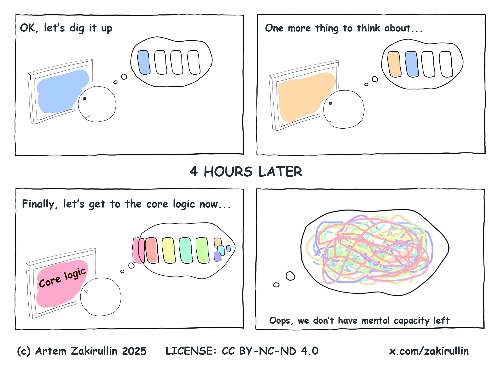

### Pairing with AI

> "Code is read more often than it is written". 

This line immediately comes to mind when someone talks about the book - Clean Code. Indeed as it has emphasized, developers have long spent more time reading and digesting each line of code rather than writing new ones. This was the norm for decades, until now. In 2022, when i was in my second year of university, chatgpt was released and i remember how it reached over 1 million users in 5days. Though it didn't change the primitive use of VSC as a code editor, it augmented the way i looked for answers. Of course, i could also google "how do i check for duplicate installations of python on my mac", and scan through 3 or 4 Stack Overflow threads before i find a crowd upvoted answer and went at it. But what it augmented was the effort it took to find a *relevant* answer (with relevancy being closely tied to attention mechanisms). Correctness, on the other hand, is a different story. 

In 2023, copilot landed (*pun intended*). It changed the way we were learning in class, completing module assignments, and forcing the university to rethink the way lab tests were doncuted. I remember patiently waiting for tab to auto-complete, then taking anywhere between 5-60 seconds reading what was generated depending on how long copilot took to generate that block. Pair programming with copilot demanded involvement, and it seemed like a seamless experience to discover new functions, understand certain code structures and learn syntax along the way. Looking back, i think that level of involvement was much underrated - perhaps a sense of ownership and accomplishment about piecing something together by hand (not really but to a certain extent).

### Code is more of a liability than before

The advances in AI in the past year (i.e. RAG, agentic AI, MCPs, harness engineering, Fable 5) were mindblowing. Pairing with AI has become a thing of the past, much less pairing with a person. The ecosystem has become so powerful that *code is more often written than it is read*. Well, not by humans atleast. Sometimes, it scares me and i start to question when i'll become obsolete. Fundamentally, code has become a commodity. Marginally, the cost of output is low because models can get it perfect in one try. Personally, I think this brings a whole new set of problems that make Software Engineering much more important. Software Engineering is about delivering functionality with less complexity. That's why so many principles / tools revolve around keeping things simple (think D-R-Y, SOLID, typescript etc.). With claude handling all that, the things that i now wrestle with are - maintaining a clear mental model of the codebase, and offloading the memory of knowledge specific to the problem at hand to the ecosystem. 

In recent sessions, i've made it an attempt to keep up with the changes Claude is making to be more in touch with the repository, even assigning shortcuts to toggle git line changes and installing extensions to organize them in a way that's easy to digest. Unfortunately, i found the bottleneck in this development loop to be myself. Digesting them takes up so much mental effort that i often get drained quicker than i'd imagined. The frustration it brought reminded me of the following point of the article - [cognitive load](https://github.com/zakirullin/cognitive-load)

### Theory Of Constraint

This [talk](https://www.youtube.com/watch?v=ByOF8qByGHU) by Farhan Thawar (Shopify's Head of Engineering) was useful in helping me realize that my frustration was simply a necessary evil in the process of optimizing a system. Optimizing a system requires you to invent solutions to make things faster, which causes bottlenecks along the way. Say you're at Yochi[^yochi], and you want to enjoy your order without having to stand in line for 30 minutes. People spend the most time picking their toppings because they can't decide what to pick literally until they see what's available and what looks good. So the shop decides to place this big display screen showcasing all the toppings, along with the prices outside the store so people queuing can already shortlist or discuss what they want. Now, you (and everyone else before you) waste no time with decorating it with your favourite toppings when you reach the topping station. After that's done, you realize you're still standing in line waiting, and the unsurprising reason is because there is only one extremely busy cashier weighing each order before you know how much to pay. Simply put, the bottleneck of getting a Yochi cup simply shifted downstream because the previous station became more efficient. 

Similar to the experience of the cashier, the pace at which claude code on *xultracode* is blazing through puts an immense strain on my cognitive ability to 

1. understand how the codebase is evolving 
2. learn from the mistakes that it had validated 
3. figure out what i was trying to do in the first place

(*the list could go on but we shall stop here*)

An experienced franchisee would notice the new bottleneck occuring at the cashier and install automated weighing stations and payment terminals to speed up this process (with the vigilance of staff of course...). But now, you'd be struggling to find a seat in a shop packed with customers. The point im trying to get at is that the cycle of discovering new bottlenecks would go on until everything else that stands between you and your satisifed craving is made more **efficient**. Same goes for how we learn to adapt to using AI more efficiently. 

### How I Cope

As mundane as it sounds, what i do in my job as a software engineer has shifted from driving the SDLC loop to ensuring that the loop goes on, in the right direction. Still, software engineers are the best candidates to do this mundane but critical job. Imagine the number of bugs that would've went to production and compromised the years of effort put in by engineers before us.

This begs the question, how can i do a better job at ensuring the loop goes on? This is what i find useful as cognitive aids (*in corresponding order to the above*) 

1) Define a glossary. Keywords are best at encapsulating what problems you are trying to solve. Having them at the top of each .md makes it easier for anyone to nail down the context
2) Persist lessons in programmatic memory. This can be as simple as a `CLAUDE.md` collecting debunked findings, `SKILLS.md` capturing procedural memory, or more complex "semantic memory"[^semantic_memory] layers. While semantic memory can be another pain to manage, tools[^tools] like [Mem0](https://github.com/mem0ai/mem0) and [Mnemon](https://github.com/mnemon-dev/mnemon) saves you much of the trouble. 
3) Go slow. Having to keep up with the pace of machines is impossible. I find it helpful to pause, scroll back to read, and take a break to stretch when i find myself reading the same sentence thrice. 

As someone who dislikes spending excessive time on tool-maxxing, i'm pretty sure this is just scratching the surface. More importantly, it would be pragmatic if i devote more time to better handle this gap, since the human bottleneck will inevitably remain in the way until we achieve AGI sometime in the future.

#### Footnotes:

[^yochi]: for the less informed, it's an australian froyo franchise that somehow has a long queue everytime you walk past it at Orchard
[^semantic_memory]: deals with storing and retrieving facts, meanings, and concepts rather than exact keyword matches 
[^tools]: Mem0 is cloud-first API that specializes in remembering info about users while Mnemon is an LLM-supervised, local binary for graph-based agent memory powered by SQLite.        

